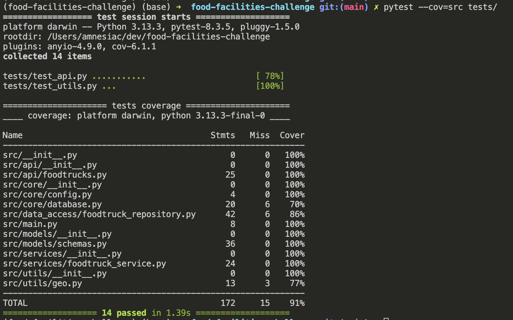

# San Francisco Mobile Food Facilities Data Application Challenge

This project implements a backend API and a simple frontend UI to query and display data about mobile food facilities in San Francisco, based on the dataset provided by SFGov.

## 📌 Problem & Solution

The goal of this challenge was to build an application that allows users to search for mobile food facility permits in San Francisco using specific criteria and to find the nearest food trucks to a given location.

### 🧩 My Solution Consists Of:
- **A Backend API**: Built with Python and the FastAPI framework. Provides endpoints to:
  - Search by applicant name or street name
  - Find the nearest food trucks by coordinates(you can specify number, 5 is default) 
  - Uses SQLite for local data storage
- **A Simple Frontend UI**: Static HTML + JavaScript frontend that interacts with the backend via fetch requests.
- **Layered architecture**: Follows separation of concerns using repository, service, and API layers. 

---


## 🛠️ Tech & Architectural Decisions

### 🔧 Backend Language & Framework

* **Python + FastAPI**: This is my go-to stack for building APIs quickly. I love how FastAPI handles validation automatically with Pydantic and gives you Swagger and ReDoc docs out of the box — it really speeds things up.

### 🗃️ Database

* **SQLite**: As I also mentioned during the interview, I went with SQLite because it’s lightweight, easy to set up, and works perfectly for small datasets like this one. Since it’s serverless, I didn’t have to worry about extra infrastructure or dependencies.

### 📥 Data Ingestion

* **`ingest_data.py` + Pandas**: I wrote a separate script using Pandas to load the data into the database. I liked keeping this logic separate from the app itself — makes things cleaner and easier to rerun or change later if needed.

### 🧭 Geospatial Calculations

* **`geopy.distance`**: I initially thought I’d implement Haversine manually after reading about it, but then I found `geopy` which handles geodesic distance more accurately and efficiently. It saved me time and gave better results.

### 🧱 Layered Design

I applied what I’ve learned from past projects to make the backend more modular by splitting it into layers:

* **Repository Layer**: Just focuses on executing SQL using `sqlite3`.
* **Service Layer**: This is where I put the main logic like filtering and distance calculations.
* **API Layer**: Handles routing and responses: all FastAPI logic lives here.

### 🧪 Testing

* **Pytest + FastAPI TestClient**: I’ve been learning how to write more meaningful backend tests recently, and I’ve started to really enjoy using Pytest. I wrote tests for both utility functions and API endpoints. The tests use a separate test DB to keep things isolated and clean.

### 🎨 Frontend

* **HTML/CSS/JS**:  Developed a minimal frontend UI to interact with the API. I prioritized functionality and user interaction, while leveraging LLM assistance for initial layout and design.

### 📄 API Docs

* **FastAPI built-in Swagger & ReDoc**: These were auto-generated and super helpful during development and debugging.

### 🐳 Docker Support

* I added a Dockerfile so the app can be run consistently anywhere. I’ve used Docker before in other projects, and I find it helpful for keeping things clean and reproducible.

---

## 🧠 Critique & Improvements

### 💡 If I Had More Time...

If I had more time, I definitely would’ve used **PostgreSQL with PostGIS** to handle the nearest location search more efficiently. I also wish I could’ve added **better error messages** (like “not found” or input validation errors) instead of just relying on the defaults from FastAPI.

The data ingestion script works, but I could’ve made it a bit more robust by cleaning the CSV more thoroughly before loading. I also didn’t get to make the backend fully **async**, which I know can help with performance. And while I wrote some unit tests, I would’ve liked to write **integration tests** between the service and database logic.

Lastly, I should’ve used something like `.env` for cleaner config instead of hardcoding paths. 

---

### ⚖️ Trade-offs I Made

| Simple and Quick        | But Sacrificed...                                  |
| ----------------------- | -------------------------------------------------- |
| Used SQLite             | Not ideal for lots of users or writes              |
| Did geolocation in code | Slower than using database features                |
| Kept the UI minimal     | Focused more on backend, so it’s not very polished |
| Wrote raw SQL           | Skipped using an ORM to keep it simple             |

I tried to keep things straightforward since this was part of assessment and I wanted to do it quick, which meant skipping over some structure or features I’d normally want in a real-world app.

---

### ❌ What I Left Out

* No authentication or login system
* No rate limiting or error monitoring
* No pagination
* No logging

Since these weren’t required, I left them out to focus on the main functionality.

---

### 🚀 If This Had to Scale...

| Challenge                         | Proposed Solution                                                                           |
| --------------------------------- | ------------------------------------------------------------------------------------------- |
| SQLite limitations under load | Migrate to **PostgreSQL** with connection pooling to handle concurrency.                    |
| Slow geospatial queries       | Use **PostGIS** to perform nearest-neighbor calculations at the database level.             |
| Limited backend throughput    | Deploy **multiple Uvicorn worker processes** behind a load balancer for higher concurrency. |
| Inefficient data ingestion    | Build a robust **ETL pipeline** to support regular and scalable data updates.               |


---

## 🚀 Getting Started

### 🔧 Requirements
- Python 3.7+
- Dataset from: [SFGov Open Data](https://data.sfgov.org/Economy-and-Community/Mobile-Food-Facility-Permit/rqzj-sfat/data)

### 📦 Installation

```bash
git clone https://github.com/timsinashok/food-facilities-challenge.git
cd food-facilities-challenge

# Install uv if not already installed
pip install uv

# Create and activate virtual environment
uv venv
source .venv/bin/activate  # On Windows: .venv\Scripts\activate

# Install project dependencies
uv pip install .
````

### 📥 Download & Ingest Data

1. Download the CSV from the [SFGov link](https://data.sfgov.org/Economy-and-Community/Mobile-Food-Facility-Permit/rqzj-sfat/data)
2. Save it as: `data/Mobile-Food-Facility-Permit.csv`
  
    If the path is different update the path in `ingest_data.py`:
    ```python
    CSV_FILE_PATH = 'data/Mobile_Food_Facility_Permit_20250504.csv'
    ```
3. Run:

```bash
python ingest_data.py
```

This creates the SQLite DB: `data/foodtrucks.db`

---

## 🧪 Run the API

```bash
uvicorn src.main:app --reload
```

Open your browser:

* Swagger UI(Automatically generated API Playground): [http://localhost:8000/docs](http://localhost:8000/docs)
* Redoc(Automatically generated API Doc): [http://localhost:8000/redoc](http://localhost:8000/redoc) 
* Frontend UI: [http://localhost:8000/](http://localhost:8000/)

---

## ✅ Running Tests

For running the tests, we need to install `dev` dependencies: 
Install them using the following: 

```bash
uv pip install ".[dev]"
```
And then use `pytest to run the test`

```bash
pytest tests/
```

This runs:

* `tests/test_api.py`
* `tests/test_utils.py`

I also tested the statement coverage of the test cases using `pytest-cov`, you can run it using the command below: 

```bash
pytest --cov=src tests/
```

The statement coverage of my test coverage are presented in the image below:



---

## 🐳 Docker Instructions

I have also setup a `Dockerfile` to easily containerize and run the application. This will be super useful in deployment.

### 🔨 Build Image

```bash
docker build -t food-facilities-app .
```

### ▶️ Run Container

```bash
docker run -p 8000:8000 food-facilities-app
```

Then open [http://localhost:8000](http://localhost:8000) in your browser.

# LLM USAGE

Absolutely! Here's a more polished and professional version that still reflects your personal experience:

---

## 🤖 LLM Usage

### 🧩 Backend

I chose **FastAPI** for its simplicity, built-in validation with Pydantic, and automatic documentation via ReDoc and Swagger. I designed the API endpoints and logic myself, and used LLMs to help refine implementations and debug faster.

### 🎨 Frontend

For the frontend, I created basic HTML forms to interact with the API. I then used an LLM to improve the UI's structure and styling, making it more intuitive and visually appealing without spending too much time on design.

And definitely I used LLM to help edit and improve this README, making it more readable, structured, and intuitive to follow.

## 💭 Reflections

I initially started by managing dependencies using just a `requirements.txt` file. As I added testing tools like `pytest`, I realized I needed a separate `requirements-dev.txt` for development dependencies — and that got me thinking there must be a better way.

That’s when I came across `pyproject.toml`. I spent some time learning how it works and how it improves dependency management, especially with support for optional dev dependencies. Switching to it made the setup cleaner, more modern, and easier to maintain going forward.


